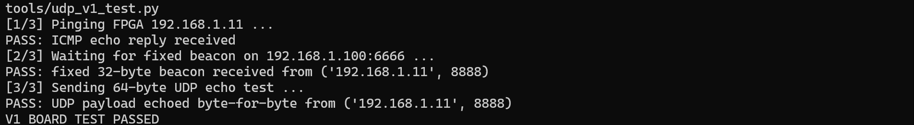

# Project 2 V1 — Gigabit Ethernet Connectivity

This page contains the V1 development, implementation, and board-test record. The [board images](../../../evidence/V1.md) and [pin/timing constraints](../../../constraints/V1.md) are indexed by version.

V1 uses the `udp_arp_icmp_loop` protocol stack as its network foundation. The Davinci board's `51_eth_udp_loop` project was used to cross-check the XC7A35T device, RGMII pins, and PHY-reset polarity.

## Functionality

- FPGA IP: `192.168.1.11`; FPGA UDP port: `8888`.
- PC IP: `192.168.1.100`; PC UDP port: `6666`.
- Reply to PC ARP requests and Ping/ICMP Echo Requests.
- Echo UDP payloads unchanged.
- While idle, send one fixed 32-byte beacon per second to the PC: `FPGA-UDP-V1-BEACON-0123456789ABC`.
- DDR3 is not used.
- The UDP application and GMII transmit side both run at 125 MHz.
- The RGMII IDELAYCTRL reference clock is 200 MHz. This corrected a configuration that requested 300 MHz while generating 250 MHz, inconsistent with the IDELAYE2 setting.

## Completed offline verification

- Vivado 2018.3 synthesis, place-and-route, and bitstream generation succeeded.
- Timing met at 125 MHz: WNS `+1.082 ns`, TNS `0.000 ns`.
- Utilization: 2,091 LUTs, 3,985 registers, and 4.5 BRAM tiles.
- Application-level simulation passed both byte-identical UDP echo and fixed-beacon checks.
- The PC test script passed Python syntax validation.
- Final bitstream SHA-256: `AB3B597C80AF45BA7FE1FBDECED11BCD206713B3E12C688C2861EDDB445CD564`.

Remaining DRC warnings concern FIFO Generator asynchronous-reset checks and unused internal nets; there were no errors or critical warnings.

## Completed board verification

The PC and FPGA were connected directly through a Type-C Gigabit Ethernet adapter. The board established a Gigabit link, answered ARP and Ping, transmitted the fixed 32-byte UDP beacon, and echoed a 64-byte UDP payload byte-for-byte. The PC program reported `V1 BOARD TEST PASSED`.



## Project contents

- `rtl/vendor/`: ARP, ICMP, UDP, and GMII network-stack modules.
- [`rtl/project2_v1_top.v`](rtl/project2_v1_top.v): Davinci board top level.
- [`rtl/udp_v1_app.v`](rtl/udp_v1_app.v): project-specific UDP echo and beacon application.
- [Clock IP configuration](ip/clk_wiz_0.xci): Vivado 2018.3 IP configuration.
- [Pin constraints](constraints/project2_v1_pins.xdc) and [timing constraints](constraints/project2_v1_timing.xdc): Davinci V2.1 board configuration.
- [Application self-test](sim/tb_udp_v1_app.v): simulation testbench.
- [`tools/udp_v1_test.py`](tools/udp_v1_test.py): one-command PC test for Ping, beacon, and UDP echo.

## Recreating the Vivado project

These steps are needed only when rebuilding from source, rerunning simulation, or regenerating the bitstream. The completed Vivado project and final bitstream are already included here.

In the Vivado 2018.3 Tcl Shell:

```tcl
cd <this_directory>
source scripts/create_project.tcl
```

The build script generates `build/project2_v1_udp.xpr` locally. Batch-mode equivalents:

```powershell
& 'C:\Xilinx\Vivado\2018.3\bin\vivado.bat' -mode batch -source scripts/create_project.tcl
& 'C:\Xilinx\Vivado\2018.3\bin\vivado.bat' -mode batch -source scripts/run_sim.tcl
& 'C:\Xilinx\Vivado\2018.3\bin\vivado.bat' -mode batch -source scripts/build_bitstream.tcl
```

## Board procedure

1. Connect the FPGA RJ45 port directly to the PC Gigabit Ethernet adapter with a Cat5e/Cat6 cable.
2. Configure the PC wired adapter with IP `192.168.1.100`, subnet mask `255.255.255.0`, and no gateway.
3. Program [`project2_v1_top.bit`](project2_v1_top.bit).
4. Confirm that Windows reports a `1.0 Gbps` wired link.
5. Run `py tools/udp_v1_test.py` in PowerShell. Ping, fixed beacon, and 64-byte UDP echo should all pass.

The PC program binds `192.168.1.100:6666`; the FPGA destination address and port are compile-time network parameters. The test pings first so the FPGA can learn the PC MAC address through ARP before its first unsolicited transmission. V1 establishes basic connectivity; throughput, packet sequence, DDR3, and long-run statistics arrive in later versions.
