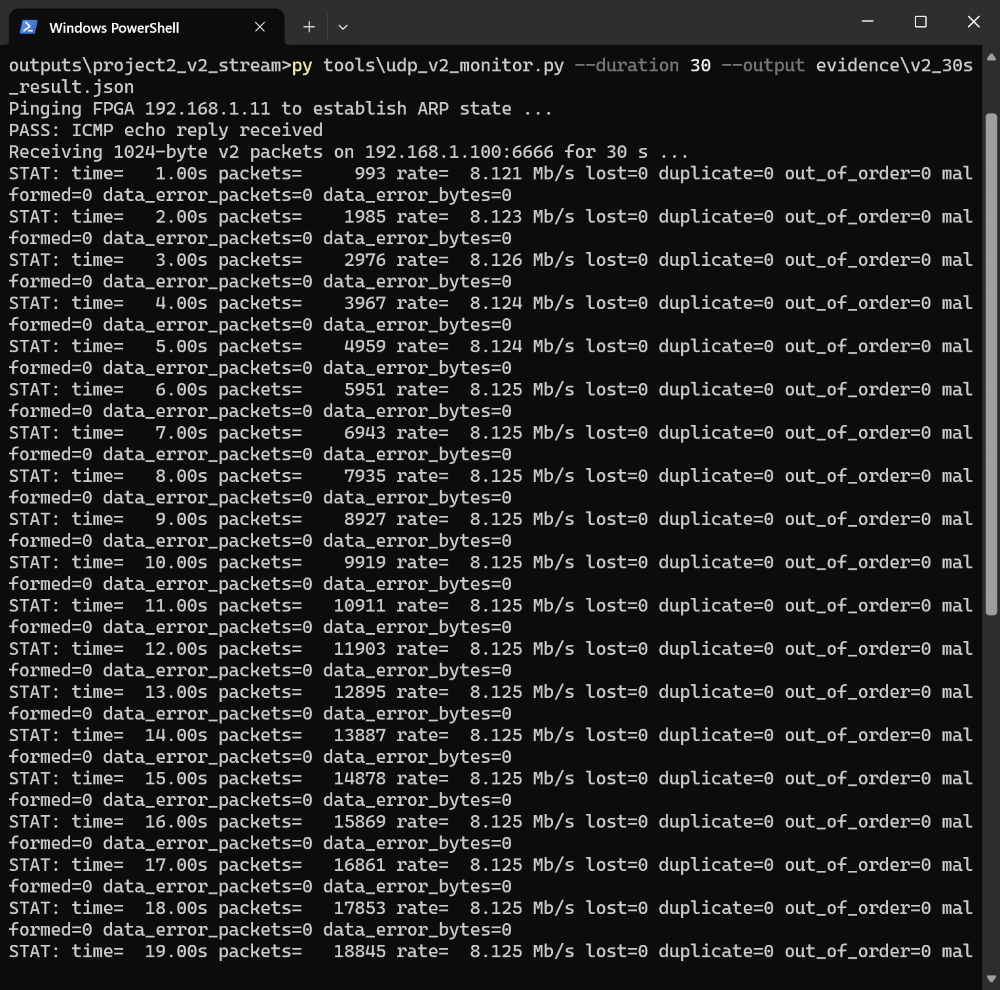
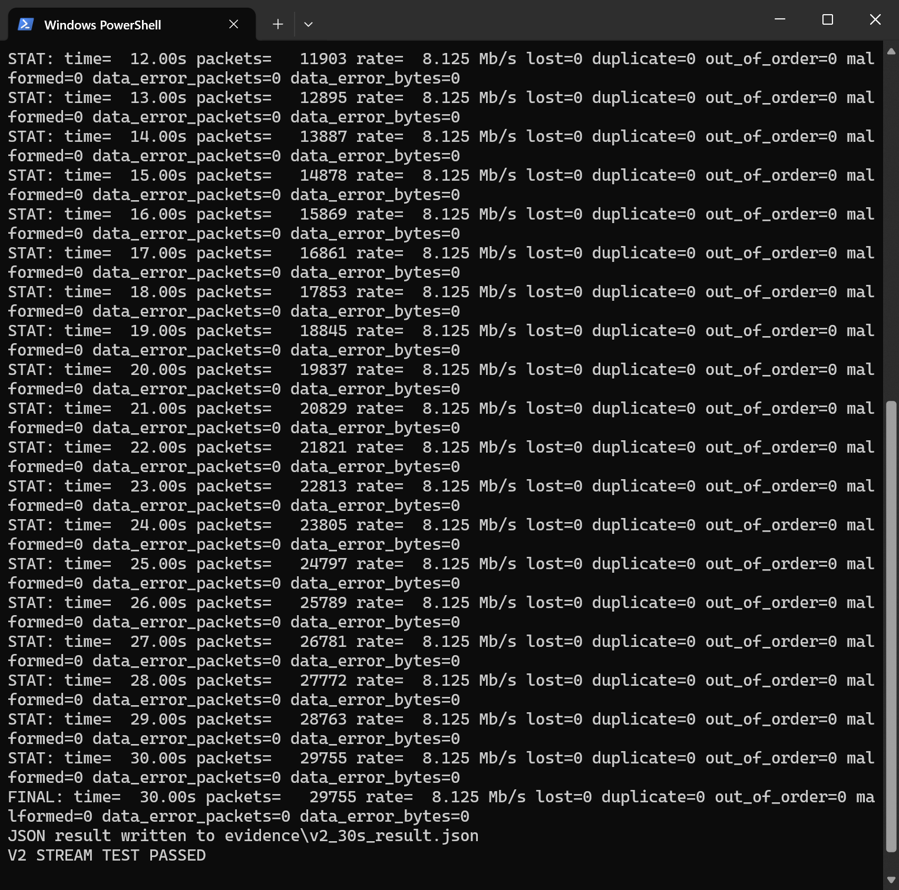

# Project 2 V2 — Continuous Incrementing Data and Packet-Sequence Statistics

This page covers the V2 frame format, receiver checks, and board result. The [board images](../../../evidence/V2.md) and [pin/timing constraints](../../../constraints/V2.md) are indexed separately.

V2 builds on V1's Gigabit Ethernet path. The final board implementation retains the ARP/ICMP/UDP/RGMII stack and Davinci pinout. DDR3 is not yet connected; V2 establishes a continuous UDP test source whose packet loss and data correctness can be measured.

## Network configuration

| Parameter | Value |
| --- | --- |
| FPGA IP / UDP port | `192.168.1.11:8888` |
| PC IP / UDP port | `192.168.1.100:6666` |
| FPGA MAC | `02:00:00:00:00:11` |

## V2 payload format

Each UDP payload is exactly 1,024 bytes. Multi-byte fields use network byte order (big-endian).

| Offset | Length | Field |
| ---: | ---: | --- |
| 0 | 4 | ASCII `P2V2` |
| 4 | 1 | Version, fixed at `2` |
| 5 | 1 | Flags, currently `0` |
| 6 | 2 | Total UDP payload length, fixed at `1024` |
| 8 | 4 | 32-bit packet sequence |
| 12 | 2 | Test-data length, fixed at `1008` |
| 14 | 1 | First incrementing data value in this packet |
| 15 | 1 | Reserved, fixed at `0` |
| 16 | 1008 | Byte-by-byte incrementing test data |

Sequence numbers start at zero and advance by one per packet. Test data begins at `00`, increments continuously within and across packet boundaries, and wraps from `FF` to `00`. The default 1 ms inter-packet gap gives approximately 1,000 packets/s or 8.192 Mb/s of UDP payload, making the counters straightforward to validate on Windows/Python.

## PC-side checks

[`tools/udp_v2_monitor.py`](tools/udp_v2_monitor.py) reports received packets and payload throughput, missing packets, duplicates, out-of-order packets, malformed packets, corrupt packets, and corrupt bytes. Run a 30-second test and retain its JSON:

```powershell
py tools\udp_v2_monitor.py --duration 30 --output evidence\v2_30s_result.json
```

When every error counter is zero, it prints `V2 STREAM TEST PASSED`.

## Vivado project

The project, simulation, and bitstream can be regenerated with:

```powershell
& 'C:\Xilinx\Vivado\2018.3\bin\vivado.bat' -mode batch -source scripts/create_project.tcl
& 'C:\Xilinx\Vivado\2018.3\bin\vivado.bat' -mode batch -source scripts/run_sim.tcl
& 'C:\Xilinx\Vivado\2018.3\bin\vivado.bat' -mode batch -source scripts/build_bitstream.tcl
```

The build script generates `build/project2_v2_stream.xpr` locally. The final bitstream is also copied to [`project2_v2_top.bit`](project2_v2_top.bit) for direct programming.

## Verification

- RTL source self-test: PASS across three packets, checking sequence, header, cross-packet increments, and `last`.
- Synthetic-frame PC parser test: PASS for a valid frame and detection of a single-byte corruption.
- Vivado 2018.3 synthesis, implementation, and bitstream: PASS.
- 125 MHz timing: WNS `+2.105 ns`, TNS `0.000 ns`.
- Utilization: 1,987 LUTs, 3,801 registers, and 4 BRAM tiles.
- Zero errors and zero critical warnings.
- Final bitstream SHA-256: `FDDDFD866F4C1650D1723310E4689523E17EA6C823EEC158E68BCDA07419ECBD`.
- Continuous board transmission through the external Type-C Gigabit adapter: PASS.

## Board result

The PC and FPGA were directly connected for a 30-second continuous UDP run. The [machine-readable result](evidence/v2_30s_result.json) records `30.00047 s`, **29,755 packets**, **30,469,120 payload bytes**, and **8.12497 Mb/s** average UDP payload throughput. First sequence was `42,911` and last was `72,665`. Missing, duplicate, out-of-order, malformed, corrupt-packet, and corrupt-byte counts were all zero. Final verdict: `V2 STREAM TEST PASSED`.




