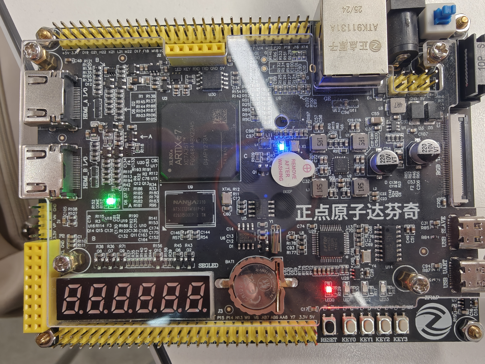
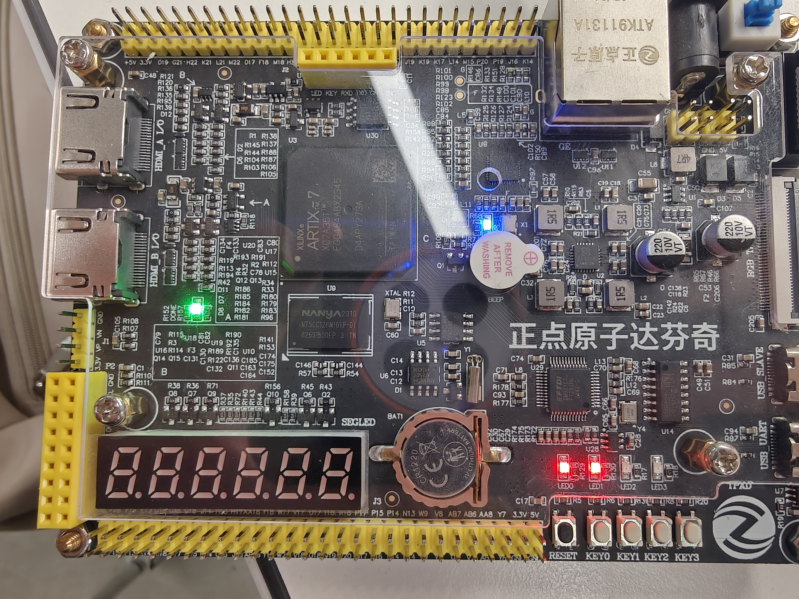
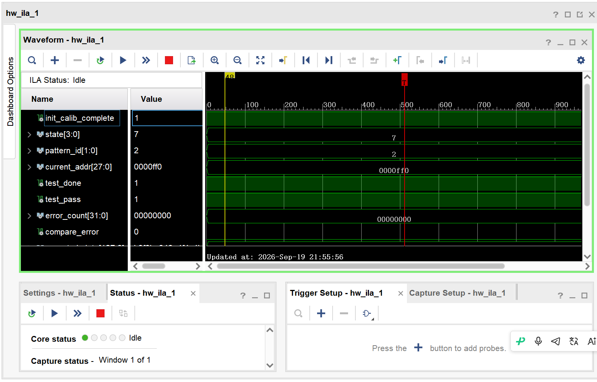
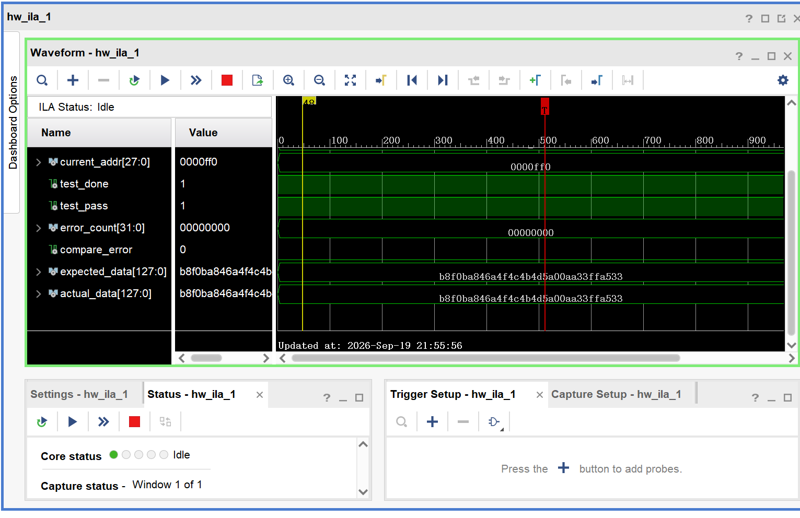

# Project 2 V3 — Standalone DDR3 Self-Test

This page covers MIG calibration, AXI read/write regression, timing, and board validation. The [board images](../../../evidence/V3.md) and [pin constraints](../../../constraints/V3.md) are indexed by version.

> **Board validation: PASS (September 19, 2026).** The calibration image held LED0 high. The AXI self-test image held both LED0 and LED1 high. Final ILA status and 128-bit data comparison passed.

V3 brings up the MIG, clocking, AXI interface, and board DDR3 connections independently of the later acquisition and Gigabit Ethernet paths. It checks stable DDR3 calibration, correct handshakes on all five AXI4 channels, and bit-exact write/readback of address data, walking-bit data, and PRBS data.

## Delivered files

- [`project2_v3_calib.bit`](project2_v3_calib.bit) / [`project2_v3_calib.ltx`](project2_v3_calib.ltx): stage A, MIG calibration only.
- [`project2_v3_axi.bit`](project2_v3_axi.bit) / [`project2_v3_axi.ltx`](project2_v3_axi.ltx): stage B, automatic AXI4 write/readback self-test in all three patterns.
- `build/calib/project2_v3_calib.xpr`: calibration project generated locally by the build script.
- `build/axi/project2_v3_axi.xpr`: full AXI self-test project generated locally by the build script.
- `reports/`: timing and utilization reports.
- [`evidence/v3_sim_result.txt`](evidence/v3_sim_result.txt): RTL self-test simulation result.

## Board validation sequence

### A. Calibrate MIG first

In Vivado Hardware Manager, program [`project2_v3_calib.bit`](project2_v3_calib.bit) with [`project2_v3_calib.ltx`](project2_v3_calib.ltx). LED0 should stay on when `init_calib_complete=1`; LED1 should stay off because no read/write test runs in this image. ILA `probe0` carries `init_calib_complete`, and `probe1` carries `ui_clk_sync_rst`. Triggering on the rising edge of `probe0` captures completion of calibration. If LED0 never lights, stop before attempting stage B.

### B. Run the AXI4 self-test

After calibration passes, program [`project2_v3_axi.bit`](project2_v3_axi.bit) with [`project2_v3_axi.ltx`](project2_v3_axi.ltx). Within a few milliseconds, both LEDs should stay on: LED0 means MIG calibration completed; LED1 means all three patterns completed with `error_count=0`.

Each pattern accesses 256 128-bit addresses, covering 4,096 bytes from base address `0x0000000`. At completion, expect `pattern_id=2`, `test_done=1`, `test_pass=1`, `write_count=768`, `read_count=768`, and `error_count=0`. The test overwrites this 4 KiB DDR3 region.

## ILA probe map

| Probe | Signal | Meaning |
| --- | --- | --- |
| 0 | `init_calib_complete` | MIG calibration complete |
| 1 | `state[3:0]` | Self-test state machine |
| 2 | `pattern_id[1:0]` | 0 = address data; 1 = walking bit; 2 = PRBS |
| 3 | `current_addr[27:0]` | Current DDR3 byte address |
| 4/5 | `awvalid/awready` | Write-address handshake |
| 6/7 | `wvalid/wready` | Write-data handshake |
| 8/9 | `bvalid/bready` | Write-response handshake |
| 10/11 | `arvalid/arready` | Read-address handshake |
| 12/13 | `rvalid/rready` | Read-data handshake |
| 14/15 | `test_done/test_pass` | Test finished/passed |
| 16 | `error_count[31:0]` | Cumulative errors |
| 17 | `compare_error` | One-cycle data-comparison error pulse |
| 18 | `expected_data[127:0]` | Expected readback |
| 19 | `actual_data[127:0]` | DDR3 readback |

For normal operation, trigger on `probe12 == 1` (`rvalid`) and inspect returned data. For error diagnosis, trigger on `probe17 == 1`. State encodings are: 0 wait for calibration; 1 start delay; 2 write address/data; 3 wait for write response; 4 issue read address; 5 wait for read data; 6 advance pattern; 7 done.

## Completed offline verification

- Vivado 2018.3 XSim: 48 writes and 48 reads across three patterns, `errors=0`.
- Both images generated bitstreams with zero DRC errors.
- Calibration image: WNS `+0.982 ns`, TNS `0 ns`.
- AXI self-test image: WNS `+0.982 ns`, TNS `0 ns`; all user timing constraints met.
- AXI image utilization, including MIG and the large ILA: 8,043 LUTs, 9,138 FFs, and 9.5 BRAM tiles.

A few BUFC/REQP/RTSTAT warnings in the Vivado reports arise within the MIG and ILA debug structure. DRC, routing, bitstream generation, and the board tests completed.

## Board evidence

**Stage A — MIG calibration.** With [`project2_v3_calib.bit`](project2_v3_calib.bit), LED0 stayed on and LED1 stayed off, as expected.



**Stage B — AXI DDR3 self-test.** With [`project2_v3_axi.bit`](project2_v3_axi.bit), LED0 and LED1 stayed on. MIG calibrated and all address-data, walking-bit, and PRBS patterns completed without AXI response or data-comparison errors.



**Stage C — ILA final state and data comparison.** ILA showed `init_calib_complete=1`, `state=7`, `pattern_id=2`, `current_addr=0x0000FF0`, `test_done=1`, `test_pass=1`, `error_count=0`, and `compare_error=0`.



For the last PRBS word, `expected_data` and `actual_data` were both `b8f0ba846a4f4c4b4d5a00aa33f1a533`, a bit-exact 128-bit match.



### What the DDR3 self-test establishes

V3 independently tests MIG, the AXI4 controller, and on-board DDR3. FPGA logic compares each 128-bit write and readback and exposes the outcome through LEDs and ILA; the observed path ends at DDR3. ILA shows `pattern_id=2`, `test_done=1`, `test_pass=1`, `error_count=0`, and matching final expected/actual data. Write and read counts were not attached to ILA; the `768/768` counts follow from the state-machine completion condition and simulation.

## Recreating the projects

Vivado 2018.3 needs a short temporary path while generating the ILA debug core. Map the workspace to a short drive letter (repeat after a restart if the mapping disappears):

```powershell
$archiveRoot = (Resolve-Path -LiteralPath '..').Path
subst V: $archiveRoot
cd V:\project2_v3_ddr3
```

Then, in the Vivado 2018.3 Tcl Shell:

```tcl
source scripts/create_project.tcl calib
source scripts/build_bitstream.tcl calib
source scripts/create_project.tcl axi
source scripts/run_sim.tcl
source scripts/build_bitstream.tcl axi
```

Or run the corresponding batch commands:

```powershell
& 'C:\Xilinx\Vivado\2018.3\bin\vivado.bat' -mode batch -source scripts/create_project.tcl -tclargs calib
& 'C:\Xilinx\Vivado\2018.3\bin\vivado.bat' -mode batch -source scripts/build_bitstream.tcl -tclargs calib
& 'C:\Xilinx\Vivado\2018.3\bin\vivado.bat' -mode batch -source scripts/create_project.tcl -tclargs axi
& 'C:\Xilinx\Vivado\2018.3\bin\vivado.bat' -mode batch -source scripts/run_sim.tcl
& 'C:\Xilinx\Vivado\2018.3\bin\vivado.bat' -mode batch -source scripts/build_bitstream.tcl -tclargs axi
```

V3 uses single-beat 128-bit AXI4 transactions to prove DDR3 and AXI data correctness with clear observation points; it is not a throughput benchmark. Later versions use bursts and connect the asynchronous FIFO, acquisition path, and UDP transmitter.
