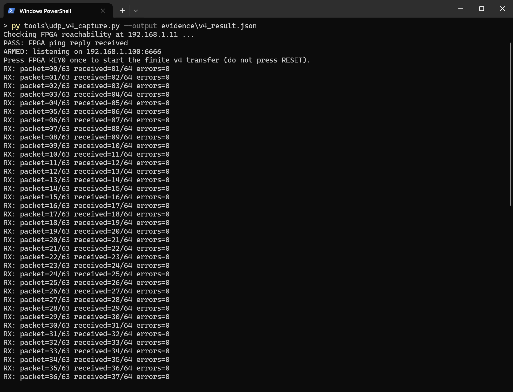
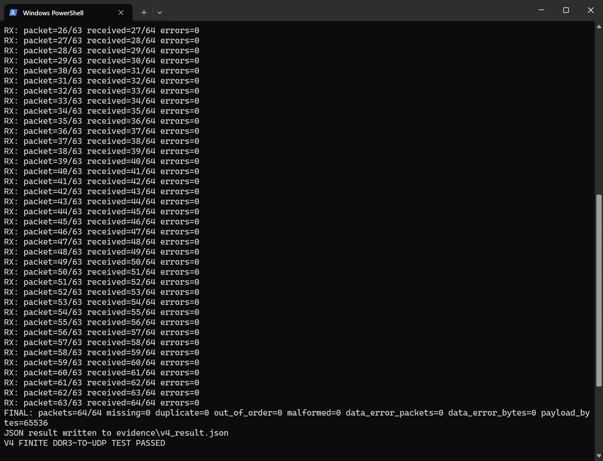
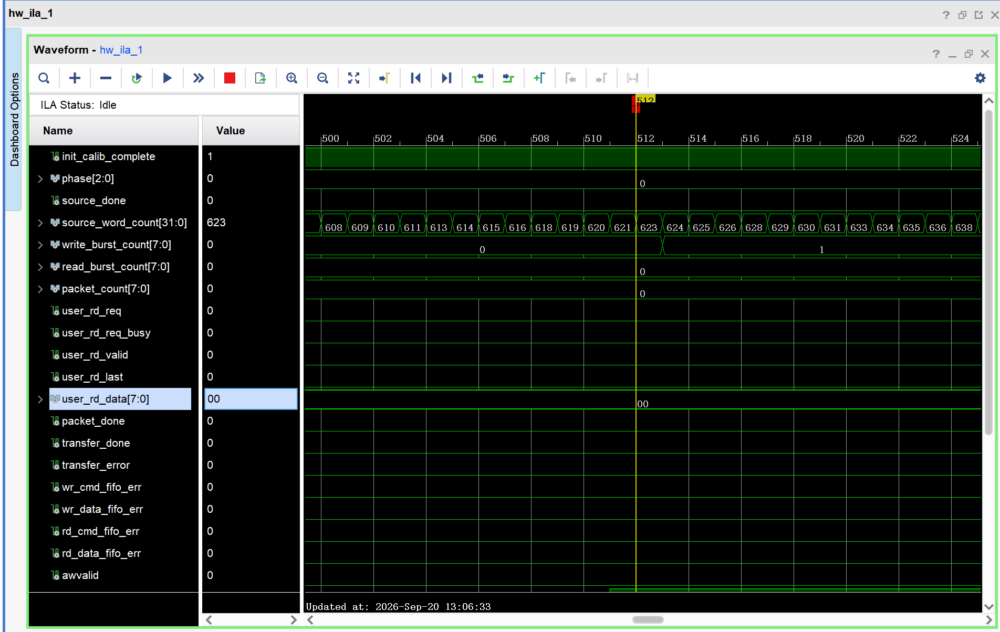
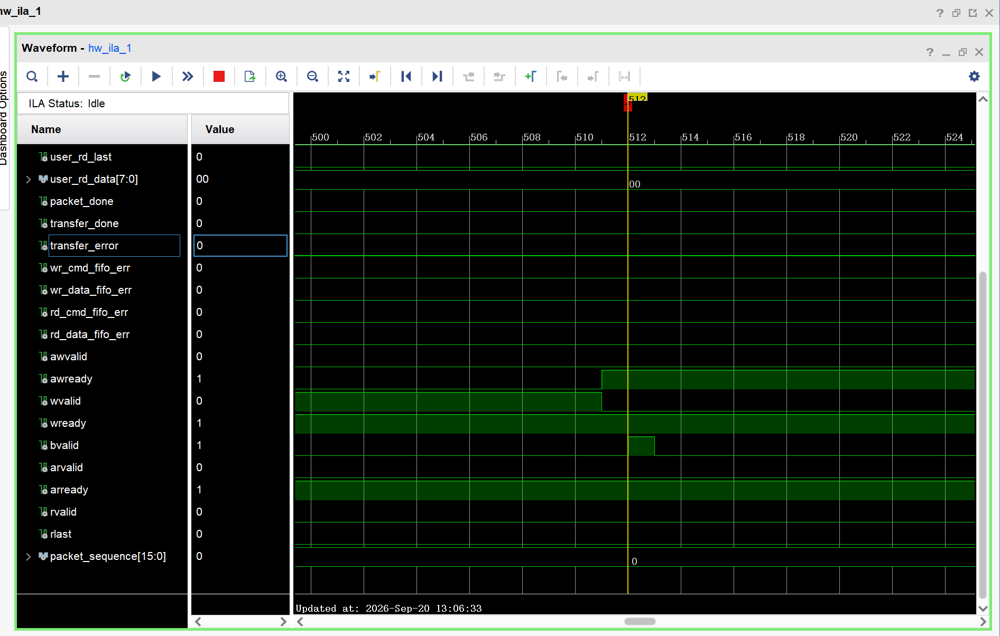
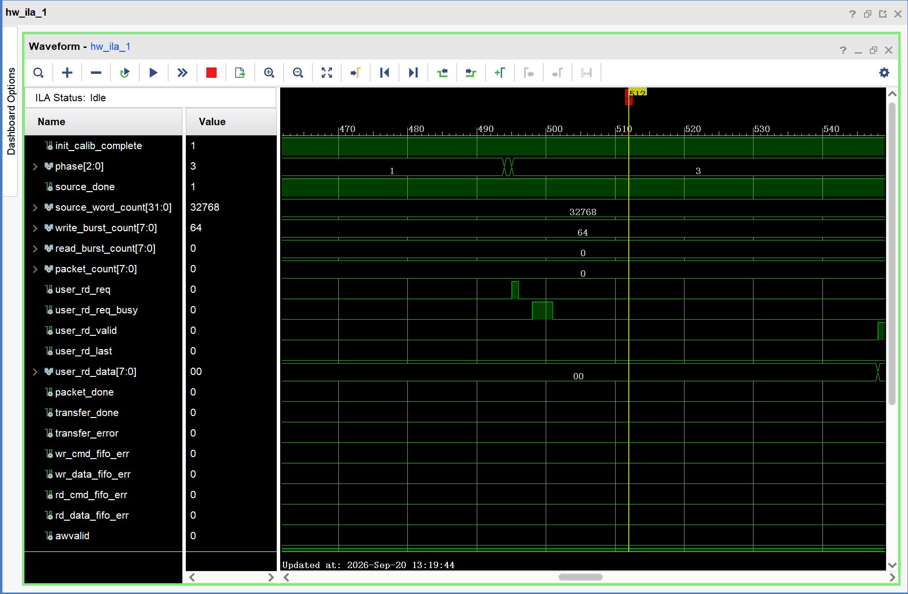
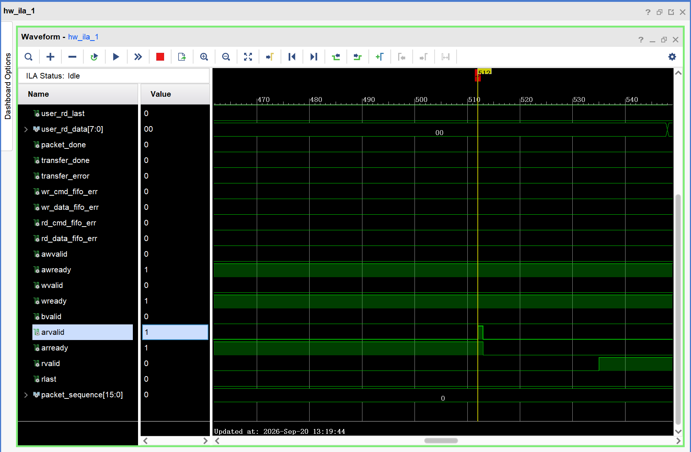
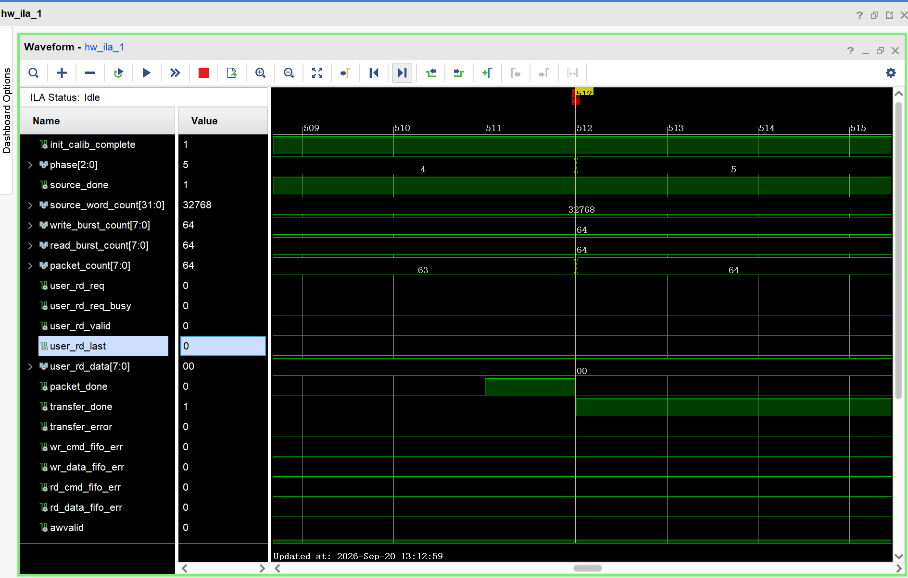
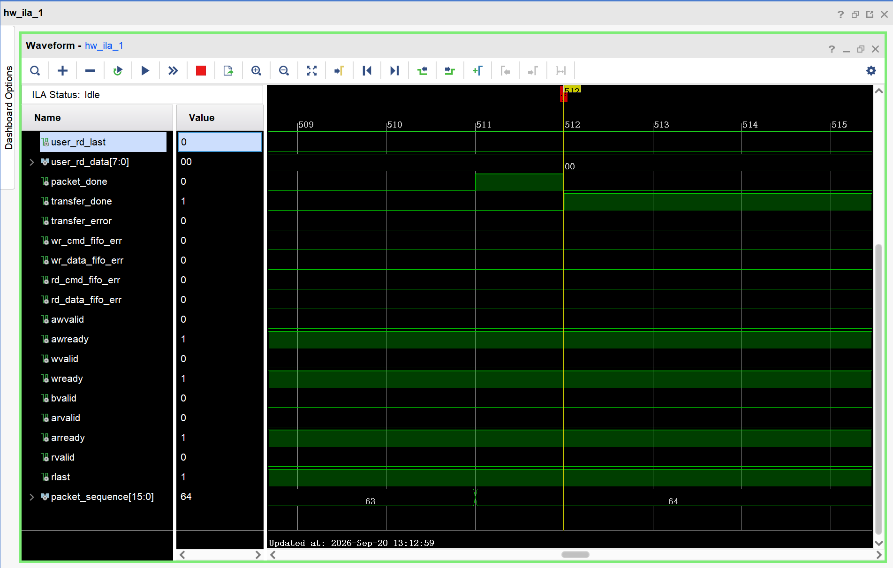

# Project 2 V4 — Finite DDR3 Data Transfer

The [V4 development record](evidence/development_log.md), [board/ILA images](../../../evidence/V4.md), and [pin/timing constraints](../../../constraints/V4.md) preserve the debugging sequence and supporting evidence.

V4 designed an end-to-end path from the previously separate DDR3 and Gigabit Ethernet modules. During September integration and board validation it completed a one-shot, fixed-length transfer:

```text
KEY0 starts the transfer
    |
PRBS16 source (125 MHz, 32,768 × 16-bit words)
    |
ADMA write-side asynchronous FIFO
    |
AXI4 write bursts -> MIG -> DDR3
    |
AXI4 read bursts <- MIG <- DDR3
    |
ADMA read-side asynchronous FIFO
    |
UDP packetizer (64 packets, 1,024 data bytes each)
    |
Gigabit Ethernet -> PC validator
```

V4 performs one 64 KiB transfer. It is neither a ring-buffer version nor a sustained-throughput test. Its purpose is to demonstrate a complete PRBS→cross-clock FIFO→ADMA→AXI4→DDR3→UDP→PC path with byte-level validation at the receiver.

## Fixed parameters

- FPGA: Xilinx Artix-7 XC7A35T-FGG484-2 on the Davinci board.
- FPGA address: `192.168.1.11:8888`; PC address: `192.168.1.100:6666`.
- FPGA MAC: `02:00:00:00:00:11`.
- PRBS16 seed: `16'hACE1`.
- Raw data: `65,536` bytes, or `32,768` 16-bit words.
- DDR3/UDP data packets: `64`, each carrying `1,024` DDR3 data bytes.
- UDP application payload: `1,040` bytes, comprising a 16-byte V4 header and 1,024 data bytes.
- DDR3 base address: zero; V4 uses a finite contiguous address range.

All multi-byte header fields are big-endian:

| Byte | Field | Value |
| --- | --- | --- |
| 0–3 | Magic | ASCII `P2V4` |
| 4 | Version | `4` |
| 5 | Flags | `1` for the final packet; otherwise `0` |
| 6–7 | Total length | `1040` |
| 8–11 | Sequence | `0` through `63` |
| 12–13 | Data length | `1024` |
| 14–15 | Total packets | `64` |

## Module integration

- The ADMA/AXI4 transfer module connects the source to DDR3.
- The final board implementation uses the DDR3 MIG parameters, package, and pin assignments validated in V3.
- It also uses the ARP, Ping, UDP, RGMII, and PHY-reset modules validated in V1/V2.
- [`rtl/vendor/adma_v1/axi_adma_v1.v`](rtl/vendor/adma_v1/axi_adma_v1.v) exposes sticky FIFO error status to ILA and the final error summary while retaining the ADMA datapath interface.
- V4 adds the finite PRBS source, transfer controller, V4 UDP packetizer, and PC validation script.

## Vivado 2018.3 build

From this directory:

```powershell
& 'C:\Xilinx\Vivado\2018.3\bin\vivado.bat' -mode batch -source scripts/create_project.tcl
& 'C:\Xilinx\Vivado\2018.3\bin\vivado.bat' -mode batch -source scripts/run_sim.tcl
& 'C:\Xilinx\Vivado\2018.3\bin\vivado.bat' -mode batch -source scripts/build_bitstream.tcl
```

The build script generates `build/project2_v4_ddr3_udp.xpr` locally. Download files are [`project2_v4_top.bit`](project2_v4_top.bit) and [`project2_v4_top.ltx`](project2_v4_top.ltx). If Vivado 2018.3 fails because the absolute project path is too long, map a temporary short drive letter:

```powershell
$archiveRoot = (Resolve-Path -LiteralPath '..').Path
subst V: $archiveRoot
cd V:\project2_v4_ddr3_udp
```

## Validation results

- Behavioral simulation passed: `V4 SOURCE/PACKETIZER SIM PASSED: words=16 packets=2 errors=0`.
- Synthesis, place-and-route, and bitstream generation completed.
- Final setup timing: WNS `+0.982 ns`, TNS `0.000 ns`; hold timing: WHS `+0.056 ns`, THS `0.000 ns`.
- Slice LUTs: `10,538 / 20,800` (50.66%); slice registers: `13,909 / 41,600` (33.44%); BRAM tiles: `11 / 50` (22.00%).
- DRC reported zero errors. The 39 retained warnings/advisories mainly involve FIFO Generator asynchronous-reset checks and MIG internals; see [`reports/drc.rpt`](reports/drc.rpt).
- The direct board test passed using a Type-C Gigabit Ethernet adapter. All 64 UDP packets arrived in sequence, with no missing, reordered, duplicate, malformed, or PRBS-corrupt packets.
- The transfer carried `65,536` bytes of DDR3 data in `66,560` bytes of UDP application payload. PC elapsed time was approximately `3.705 s`.
- LED1 lit after KEY0, indicating completion without an internal transfer error.

**Result: the finite V4 DDR3→UDP end-to-end board transfer passed.** The [formal PC JSON](evidence/v4_result.json) reports:

```text
packets=64/64
missing=0, duplicate=0, out_of_order=0, malformed=0
data_error_packets=0, data_error_bytes=0
payload_bytes=65536
V4 FINITE DDR3-TO-UDP TEST PASSED
```





## Board test procedure

1. Set the Type-C Gigabit Ethernet adapter's IPv4 address to `192.168.1.100`, subnet mask to `255.255.255.0`, and leave gateway/DNS blank. Confirm a 1.0 Gbps Windows link.
2. Program [`project2_v4_top.bit`](project2_v4_top.bit) in Vivado Hardware Manager; associate [`project2_v4_top.ltx`](project2_v4_top.ltx) if using ILA.
3. Wait for the Ethernet link and LED0. LED0 means `init_calib_complete=1`: DDR3 MIG calibration has completed.
4. In PowerShell, enter this directory and arm the receiver: `py tools\udp_v4_capture.py --output evidence\v4_result.json`.
5. Once it displays `ARMED`, press **KEY0** briefly to start the transfer. Do not press RESET: that resets the PHY, MIG, and entire design.
6. The receiver should get sequences `0..63` and independently regenerate/check each PRBS16 byte.

Expected terminal output:

```text
FINAL: packets=64/64 missing=0 duplicate=0 out_of_order=0 malformed=0 data_error_packets=0 data_error_bytes=0 payload_bytes=65536
V4 FINITE DDR3-TO-UDP TEST PASSED
```

The program writes [`evidence/v4_result.json`](evidence/v4_result.json). LED1 indicates that FPGA transfer completed without AXI, FIFO, or packetizer errors. KEY0 is active-low on FPGA pin T1; board RESET is on U2. Both inputs have internal pull-ups in the constraints.

## ILA verification

ILA samples MIG `ui_clk` at a depth of 1,024. Two useful dynamic triggers are:

1. **Start/write:** rising `probe29 start_latched`. Watch `probe2 source_done` eventually reach 1, `probe3 source_word_count` reach 32,768, `probe4 write_burst_count` reach 64, and AXI AW/W/B handshakes on `probe19..23`.
2. **Read/transmit:** rising `probe7 user_rd_req` or `probe13 transfer_done`. Watch `probe5 read_burst_count` and `probe6 packet_count` reach 64, AR/R/RLAST handshakes on `probe24..27`, and `probe28 packet_sequence` progress from 0 to 63.

The final state is `probe0 init_calib_complete=1`, `probe1 phase=5`, `probe2 source_done=1`, `probe3 source_word_count=32768`, `probe4 write_burst_count=64`, `probe5 read_burst_count=64`, `probe6 packet_count=64`, `probe13 transfer_done=1`, `probe14 transfer_error=0`, and all four FIFO errors on `probe15..18` equal to zero.

Because V4 runs only once per reset, a missed dynamic capture requires RESET, rearming the PC receiver until it displays `ARMED`, and then pressing KEY0 again.

### Recorded ILA results

Three formal capture groups passed; originals are in `evidence/`.

**1. AXI write to DDR3.** Triggered on `bvalid=1`. AXI write-address, write-data, and write-response activity is present; `write_burst_count` advances from 0 to 1 after the response while `source_word_count` rises. `transfer_error`, `wr_cmd_fifo_err`, and `wr_data_fifo_err` are zero.





**2. DDR3 readback.** Triggered on `arvalid=1`, with `arvalid=1` and `arready=1` at the trigger. Writing had completed: `source_done=1`, `source_word_count=32768`, and `write_burst_count=64`. The trace captures `user_rd_req`, `user_rd_req_busy`, the AXI read-address handshake, and subsequent `rvalid` data. `transfer_error`, `rd_cmd_fifo_err`, and `rd_data_fifo_err` are zero.





**3. Finite-transfer completion.** Triggered on `transfer_done=1`. `phase` advances from 4 to terminal state 5; `packet_count` and `packet_sequence` advance from 63 to 64. Final counts are 32,768 source words and 64 each for write bursts, read bursts, and packets. `transfer_done=1`, `transfer_error=0`, and all four FIFO error flags are zero.





An ILA capture containing only post-reset idle state is not evidence of a target handshake. Arm the ILA until it reports `Waiting for Trigger`, then repeat the capture.

## Initial timing failure and correction

The first complete implementation did not meet timing. Its initial report showed about `−1.986 ns` WNS; the retained route log shows `−1.993/−1.991 ns` WNS and about `−520.7 ns` TNS. Worst-path inspection found that Vivado treated MIG `clk_pll_i` and Clocking Wizard's 125 MHz `clk_out2_clk_wiz_0` as phase-related clocks.

Actual cross-domain data travels through asynchronous FIFOs, and sticky status signals use two-flop synchronizers. The clocks were therefore explicitly declared asynchronous in [`constraints/project2_v4_timing.xdc`](constraints/project2_v4_timing.xdc). Rerouting produced `+0.982 ns` WNS at the original operating frequency. This corrected the CDC timing model; the [development record](evidence/development_log.md) documents the sequence.

## Main files

- [`rtl/project2_v4_top.v`](rtl/project2_v4_top.v): top level, KEY0 start latch, DDR3/ADMA/UDP/ILA integration.
- [`rtl/prbs16_finite_source.v`](rtl/prbs16_finite_source.v): finite PRBS16 source.
- [`rtl/v4_transfer_controller.v`](rtl/v4_transfer_controller.v): write completion, finite readback, and terminal-state control.
- [`rtl/udp_v4_packetizer.v`](rtl/udp_v4_packetizer.v): V4 header and DDR3-data packetization.
- [`rtl/ddr3_axi_mig_wrapper.v`](rtl/ddr3_axi_mig_wrapper.v): MIG AXI4 wrapper.
- [`tools/udp_v4_capture.py`](tools/udp_v4_capture.py): PC sequence, completeness, and byte-level PRBS validation.
- [Final timing](reports/timing_summary.rpt), [utilization](reports/utilization.rpt), and [DRC](reports/drc.rpt) reports.
- [Development record](evidence/development_log.md): debugging sequence and acceptance boundaries.
